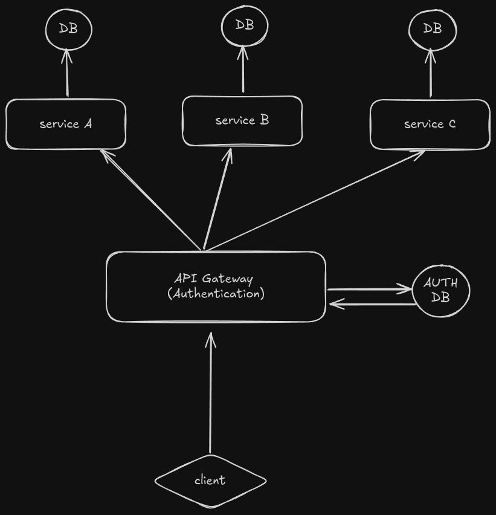

# Pocketbase Gateway

Pocketbase Gateway is a Golang-based API Gateway that routes requests to different services while handling authentication. The gateway serves as a central entry point for all client requests and ensures secure communication with various backend services.

## Architecture



- **Client**: The entry point for user interactions.
- **API Gateway (Authentication)**: Handles authentication and routes client requests to the appropriate service. Interacts with the `AUTH DB` to validate and manage authentication tokens.
- **Service A, B, C**: Backend services that the API Gateway forwards requests to. Each service has its own dedicated database.
- **AUTH DB**: The database used by the API Gateway for managing user authentication and authorization.

## Features

- **Authentication**: Secure API Gateway that validates user credentials and manages JWT tokens.
- **Routing**: Forward client requests to the appropriate backend service based on the URL path.
- **Service Communication**: Facilitate communication between different backend services.

## Configuration

Here's an example of the configuration file used by the API Gateway:

```yaml
rate_limiter_memory_store:
  rate: 10
  burst: 30
  expires_in: 3m
  blacklist_ips:
    - "192.168.1.1"
    - "10.0.0.5"
    - "172.16.0.3"

services:
- host: localhost
  name: example_service
  port: 8080
  protocol: http
  permission: require_record_auth
  routes:
  - name: example_route
    paths: /v1/*

- host: localhost
  name: example_service
  port: 8081
  protocol: http
  permission: require_record_auth
  routes:
  - name: example_route
    paths: /v2/*

```

## Installation
```
git clone https://github.com/yourusername/pocketbase-gateway.git
cd pocketbase-gateway
go mod tidy

```
## Running the Gateway
```
go run main.go
```

